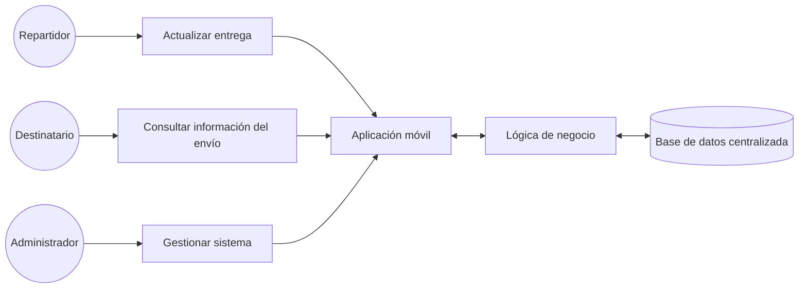
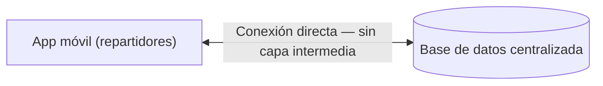
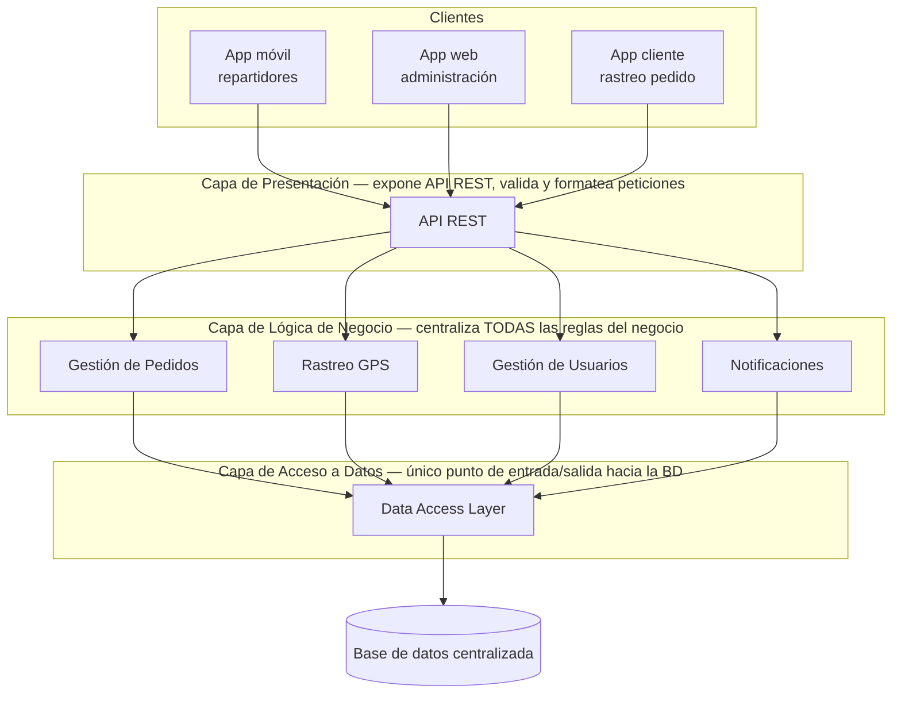
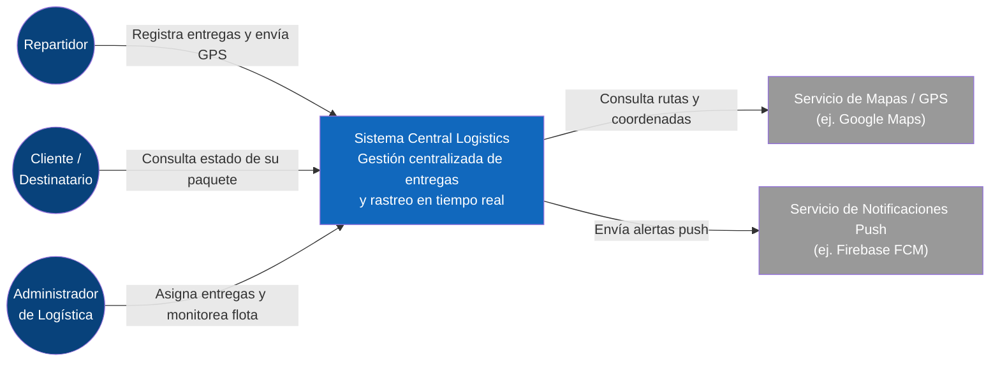
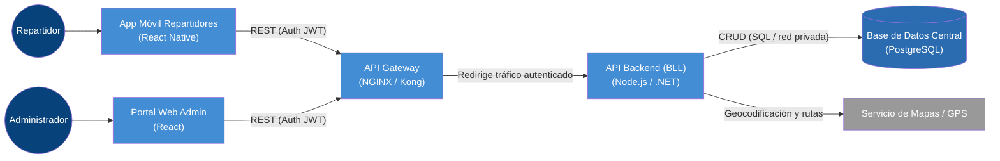

# Central Logistics — Propuesta de Arquitectura N-Capas

## 1. Identificación de estilos arquitecturales

| Aspecto | Cliente-Servidor | N-Capas | Microservicios |
|---|---|---|---|
| Niveles | 2 niveles | 3+ niveles | N servicios |
| Lógica de negocio | Dispersa (cliente y/o BD) | Centralizada en una capa | Distribuida por servicio |
| Acceso a la BD | Directo desde el cliente | Solo vía capa de negocio | Cada servicio, su propia data |
| Escalabilidad | Baja | Media (por capa completa) | Alta (por servicio) |
| Seguridad | Baja (BD expuesta) | Alta (BD protegida) | Alta, más superficie de ataque |
| Complejidad | Baja | Media | Alta |

**Idea clave:** no es cuántas capas tiene, es **dónde vive la responsabilidad de la lógica** y **quién puede tocar los datos directamente**.

- **Cliente-Servidor:** el cliente habla directo con el servidor (o la BD). Sin capas intermedias que separen responsabilidades.
- **N-Capas:** presentación, lógica de negocio y datos viven en capas separadas. Nadie accede a la BD sin pasar por la capa de negocio.
- **Microservicios:** la aplicación se parte en servicios pequeños e independientes, cada uno con su propia responsabilidad y despliegue.

---

## 2. Atributos de calidad: Disponibilidad y Escalabilidad

**Escalabilidad** — capacidad del sistema para absorber más carga (usuarios, peticiones) sin degradar el rendimiento.
Un pico de tráfico en temporada de descuentos exige repartir la carga entre varias instancias. Cliente-Servidor solo escala verticalmente (techo limitado). N-Capas permite escalar horizontalmente la capa de negocio replicando instancias.

**Disponibilidad** — probabilidad de que el sistema esté operativo y respondiendo cuando se le necesita.
En Cliente-Servidor, si el único servidor/BD cae, todo el sistema cae con él (punto único de falla). Con varias instancias de la capa de negocio detrás de un balanceador, una falla no tumba el sistema completo.

> **Conclusión:** estos dos atributos, más que una preferencia de diseño, son la razón técnica que empuja a Central Logistics a dejar Cliente-Servidor y adoptar N-Capas: una capa de negocio centralizada y replicable, capaz de escalar y absorber fallas sin caer por completo.

---

## 3. Terminología: Vistas y Perspectivas (Rozanski & Woods)

**Vistas:** según Rozanski y Woods, una vista es una representación de uno o más aspectos estructurales de una arquitectura, que muestra la forma en que la arquitectura gestiona una o más preocupaciones manifestadas por uno o varios stakeholders. El concepto va ligado al de *punto de vista*: un conjunto de patrones, plantillas y convenciones para construir un tipo de vista.

**Perspectivas:** un conjunto de actividades, tácticas y lineamientos que se usan para garantizar que un sistema cumple con unas propiedades de calidad determinadas. Se pueden entender como los **atributos de calidad** de un sistema (requerimientos no funcionales).

> **Conclusión:** las vistas y perspectivas tienen una relación estrecha, ya que tratan temas relativos a la arquitectura de un sistema. Sin embargo, las perspectivas pueden entenderse como algo transversal a las vistas y puntos de vista, ya que permiten modificar las vistas existentes, y constituyen los atributos de calidad.
>
> Fuente: Rozanski, N., & Woods, E. (s.f.). *Software Systems Architecture*. https://www.viewpoints-and-perspectives.info/

---

## 4. Actores, restricciones y limitaciones

### Actores



### Restricciones

| Restricción | ¿Por qué? |
|---|---|
| **Escalabilidad**: soportar +300% de tráfico en temporadas de descuento | Es una exigencia de diseño a futuro, no un problema actual |
| **Mantenibilidad**: lógica de negocio centralizada, no dispersa en cada app | Exige cómo se debe construir el sistema para que sea fácil de actualizar |
| **Seguridad**: ningún dispositivo externo con acceso directo a la BD | Regla dura de protección de datos, no negociable |

### Limitaciones

- **Acceso directo a la base de datos:** la app móvil se comunica directamente con la BD, generando una limitación de seguridad y control de acceso.
- **Lógica de negocio dispersa:** distribuida entre las aplicaciones y procedimientos almacenados, aumentando la complejidad del sistema.
- **Dependencia entre las aplicaciones y la lógica:** cambios en la lógica pueden requerir modificar las apps de los repartidores, dificultando el mantenimiento.
- **Escalabilidad del sistema:** el crecimiento de tráfico hasta un 300% representa un desafío para la capacidad de respuesta actual.

---

## 5. Estilo actual de Central Logistics

*Cliente-Servidor de 2 niveles*



**Lógica de negocio dispersa:** parte en la app, parte en procedimientos almacenados.

**Evidencia en el caso:** *"Los repartidores usan una aplicación móvil que se comunica directamente con una base de datos centralizada, pero la lógica de negocio está dispersa entre el código de la app y algunos procedimientos almacenados."*

### ¿Por qué es ineficiente según los atributos de calidad?

1. **Escalabilidad** — Necesita soportar +300% de tráfico en temporada de descuentos. Un modelo de 2 niveles escala verticalmente (más recursos al mismo servidor/BD); no distribuye la carga, así que un pico de tráfico satura el único punto de acceso a los datos.
2. **Mantenibilidad** — Un cambio en la lógica de negocio no debería obligar a actualizar todas las apps. Al estar la lógica dispersa entre la app y procedimientos almacenados, cada cambio de reglas implica tocar dos lugares distintos y redistribuir la app a todos los repartidores.
3. **Seguridad** — Ningún dispositivo externo debe acceder directamente a la BD. En Cliente-Servidor la app se conecta directo a la BD centralizada: cualquier dispositivo comprometido es una puerta abierta a los datos de la empresa.

---

## 6. Solución propuesta: Arquitectura N-Capas



---

## 7. Modelo C4 (Structurizr DSL)

Diagrama completo — Contexto, Contenedores y Componentes — del **Sistema Modernizado de Seguimiento de Entregas**.

### 7.1 Nivel 1 — Contexto



### 7.2 Nivel 2 — Contenedores



### 7.3 Nivel 3 — Componentes (dentro de API Backend)

```mermaid
graph LR
    apiGateway["API Gateway"]:::container
    authController["Auth Controller & Middleware<br/>Valida tokens JWT y permisos"]:::component
    deliveryController["Delivery Controller<br/>Entrada REST de entregas/rastreo"]:::component
    trackingService["Tracking & Delivery Service<br/>Reglas de negocio de entregas"]:::component
    routeService["Route & GPS Service<br/>Distancias, geocercas, ubicaciones"]:::component
    notificationComponent["Notification Service<br/>Integración con alertas externas"]:::component
    dal["Data Access Layer (DAL)"]:::component
    database[("Base de Datos Central")]:::database
    notificaciones["Servicio de Notificaciones Push"]:::external

    apiGateway -->|"Bearer Token"| authController
    authController -->|"Petición validada"| deliveryController
    deliveryController -->|"Invoca entrega"| trackingService
    deliveryController -->|"Envía coordenadas GPS"| routeService
    trackingService -->|"Evento cambio de estado"| notificationComponent
    trackingService -->|"Persiste cambios"| dal
    routeService -->|"Guarda historial"| dal
    notificationComponent -->|"Payload de notificación"| notificaciones
    dal -->|"SQL / TCP"| database

    classDef container fill:#438dd5,color:#fff;
    classDef component fill:#85bbf0,color:#000;
    classDef database fill:#2b6cb0,color:#fff;
    classDef external fill:#999,color:#fff;
```



### 7.4 Código fuente Structurizr DSL

```dsl
workspace "Central Logistics" "Sistema Modernizado de Seguimiento de Entregas" {

    model {
        # --- PERSONAS / ACTORES ---
        repartidor = person "Repartidor" "Personal en campo encargado de entregar paquetes y actualizar estados."
        cliente = person "Cliente / Destinatario" "Usuario final que consulta el estado de su envío."
        admin = person "Administrador de Logística" "Gestiona la flota, asignación de rutas y reportes."

        # --- SISTEMAS EXTERNOS ---
        mapas = softwareSystem "Servicio de Mapas / GPS" "Provee servicios de geolocalización y optimización de rutas (ej. Google Maps)." "External"
        notificaciones = softwareSystem "Servicio de Notificaciones Push" "Envía alertas a los dispositivos móviles (ej. Firebase FCM)." "External"

        # --- SISTEMA PRINCIPAL ---
        centralLogistics = softwareSystem "Sistema Central Logistics" "Gestión centralizada de entregas y rastreo en tiempo real." {

            appMovil = container "App Móvil Repartidores" "Permite ver rutas, registrar entregas y enviar coordenadas GPS." "React Native" "Mobile"
            portalWeb = container "Portal Web Admin" "Panel de control para gestión de flota y monitoreo." "React" "Web Browser"
            apiGateway = container "API Gateway" "Punto de entrada único. Realiza autenticación JWT, Rate Limiting y enrutamiento." "NGINX / Kong"

            apiBackend = container "API Backend (BLL)" "Centraliza la lógica de negocio, validaciones y reglas de entrega." "Node.js / .NET" {
                authController = component "Auth Controller & Middleware" "Valida tokens JWT y permisos de usuario." "Controller / Middleware"
                deliveryController = component "Delivery Controller" "Punto de entrada REST para operaciones de entregas y rastreo." "REST Controller"
                trackingService = component "Tracking & Delivery Service" "Centraliza las reglas de negocio de entregas, cambio de estados y firmas." "Business Logic Component"
                routeService = component "Route & GPS Service" "Calcula distancias, valida geocercas y procesa ubicaciones." "Business Logic Component"
                notificationComponent = component "Notification Service" "Gestiona la integración y envío de alertas a servicios externos." "Integration Component"
                dal = component "Data Access Layer (DAL)" "Abstrae el acceso a la base de datos central mediante consultas controladas." "ORM / Repository"
            }

            database = container "Base de Datos Central" "Almacena datos de paquetes, usuarios, entregas e historial. Aislada en red privada (VPC)." "PostgreSQL" "Database"
        }

        # RELACIONES DE CONTEXTO
        repartidor -> centralLogistics "Registra entregas y envía ubicación GPS" "HTTPS / App Móvil"
        cliente -> centralLogistics "Consulta el estado de su paquete" "HTTPS / Web - Móvil"
        admin -> centralLogistics "Asigna entregas y monitorea la flota" "HTTPS / Web Dashboard"
        centralLogistics -> mapas "Consulta rutas y coordenadas" "HTTPS / REST API"
        centralLogistics -> notificaciones "Envía alertas push" "HTTPS / REST API"

        # RELACIONES DE CONTENEDOR
        repartidor -> appMovil "Usa"
        admin -> portalWeb "Usa"
        appMovil -> apiGateway "Peticiones REST (Auth JWT)" "HTTPS / JSON"
        portalWeb -> apiGateway "Peticiones REST (Auth JWT)" "HTTPS / JSON"
        apiGateway -> apiBackend "Redirige tráfico autenticado" "HTTP"
        apiBackend -> database "Lee y escribe datos (CRUD)" "SQL / TCP (Red Privada)"
        apiBackend -> mapas "Geocodificación y rutas" "HTTPS / REST"

        # RELACIONES DE COMPONENTES
        apiGateway -> authController "Petición HTTP con Bearer Token" "HTTPS"
        authController -> deliveryController "Pasa petición validada" "In-Process Call"
        deliveryController -> trackingService "Invoca operaciones de entrega" "In-Process Call"
        deliveryController -> routeService "Envía coordenadas GPS" "In-Process Call"
        trackingService -> notificationComponent "Dispara evento de cambio de estado" "In-Process Call"
        trackingService -> dal "Persiste cambios de estado" "In-Process Call"
        routeService -> dal "Guarda historial de ubicación" "In-Process Call"
        notificationComponent -> notificaciones "Envía payload de notificación" "HTTPS / REST"
        dal -> database "Ejecuta consultas SQL en la red interna" "SQL / TCP"
    }

    views {
        systemContext centralLogistics "Diagrama_Contexto" {
            include *
            autoLayout lr
        }

        container centralLogistics "Diagrama_Contenedores" {
            include *
            autoLayout lr
        }

        component apiBackend "Diagrama_Componentes" {
            include *
            autoLayout lr
        }

        styles {
            element "Person" {
                shape Person
                background #08427b
                color #ffffff
            }
            element "Software System" {
                background #1168bd
                color #ffffff
            }
            element "External" {
                background #999999
                color #ffffff
            }
            element "Container" {
                background #438dd5
                color #ffffff
            }
            element "Database" {
                shape Cylinder
                background #2b6cb0
                color #ffffff
            }
            element "Mobile" {
                shape MobileDevicePortrait
            }
            element "Web Browser" {
                shape WebBrowser
            }
            element "Component" {
                background #85bbf0
                color #000000
            }
        }
    }
}

```

---
